# Progress

What the site actually looked like at each stage, rebuilt from git history
by `npx tsx scripts/progress.ts`. Reasoning behind each move is in
[`DECISIONS.md`](DECISIONS.md).

Every image below is a real screenshot of that commit running, not a mockup.

---

## The warm direction

`5901a7e`

The first look, and the one that got rejected. Cream ground, Fraunces display, terracotta accent, artefacts in an ordinary two-column grid. Worth keeping in the record: warm cream, a high-contrast serif and terracotta is the combination every template reaches for, so the rejection was right for reasons that took a while to articulate.

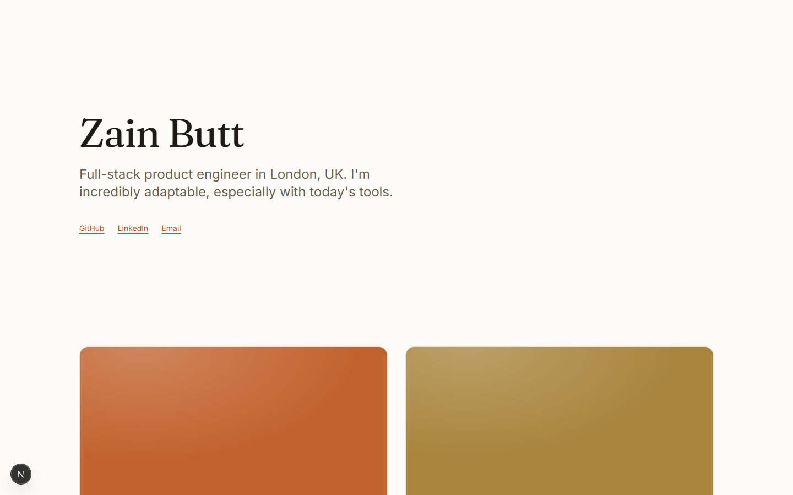

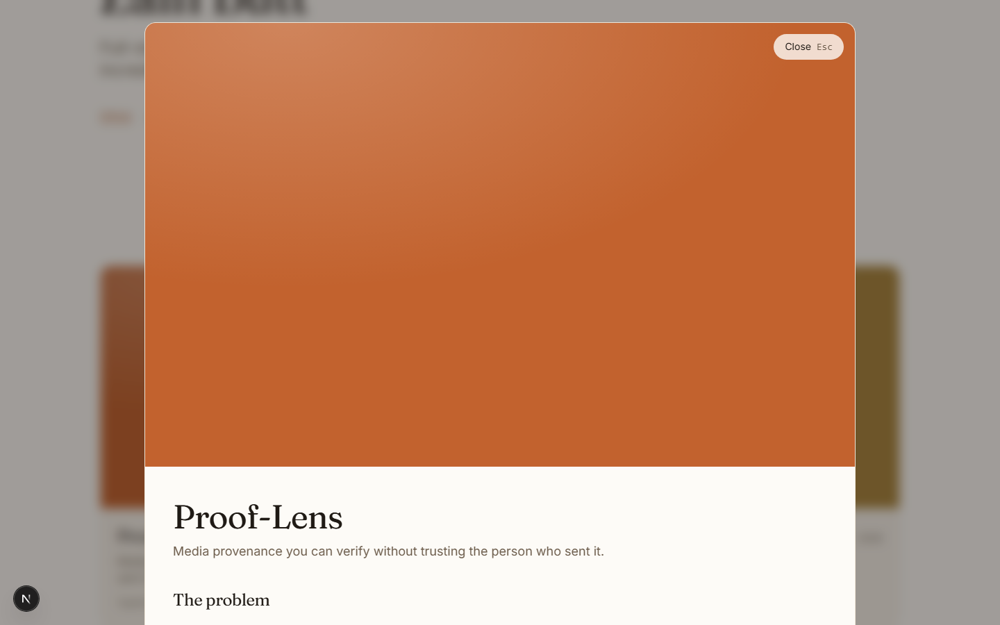

---

## White page, flanking field

`7e1321a`

First real layout. Name centred, About in the middle column, artefacts staggered down either side. Opening a project morphed a card into a separate panel.

---

## One box, expanding in place

`876c5e0`

The morph was scrapped. The artefact itself now grows, its corners travelling outward via clip-path — but still over the page, so About sat behind it.

---

## A camera, not a panel

`5eb4f95`

The page became a plane the camera moves. Neighbours keep their spatial relationship instead of being covered — but the artefact was still framed too wide, so About stayed occluded.

---

## First design pass

`8e76b87`

The first stage built while actually looking at the site. Metadata moved under the hero, stack became chips, and a close button that had been rendering at 2.3x on top of the tagline was fixed.

---

## The field arrives

`1f98e47`

A lattice the page's contents deform. Still on white, and still competing with the reading.

---

## Deep space

`f7d2430`

Ground inverted to deep space blue with a starfield and nebulae. The dark app screenshots stopped fighting the page. The lattice no longer folds through itself.

---

## Choreography

`3e03731`

Every duration and curve moved into one motion language. The case study resolves in sequence behind the opening edge rather than arriving flat with it, hovering an artefact deepens its own well so the field forecasts the open, and the first load assembles the lattice instead of showing a loader.

---

## Identity

`HEAD`

Crops replaced full-window captures, so the flagship artefacts are legible at card size. A monospace took over every piece of data — years, stack chips, metadata labels — and stays out of prose. Bodoni Moda replaced Fraunces for display, though the comparison that chose it also proved the display face touches only four elements and cannot carry identity on its own.

The ground stopped being flat. It is graded from an indigo lift overhead down to near-black at the edges, and the nebulae now differ in hue rather than only in lightness. The 404 renders the field instead of dropping the visitor out of the world.

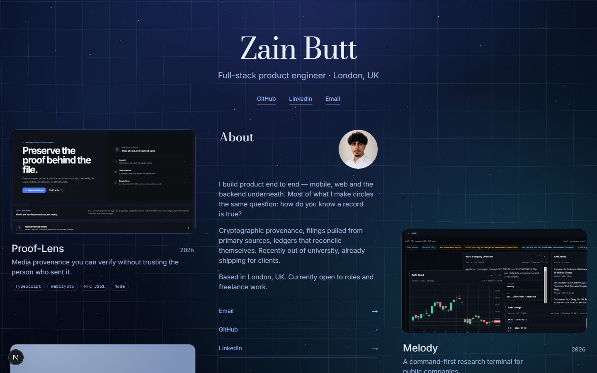

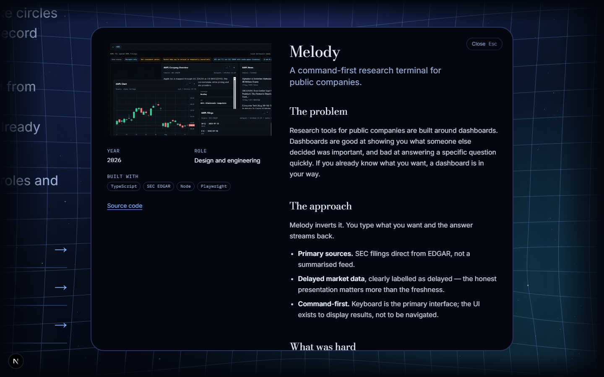

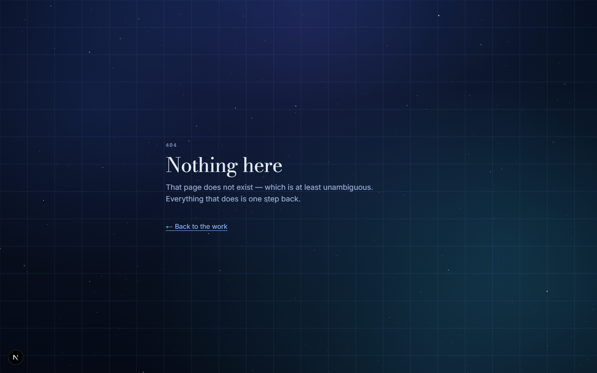

---

## Content

`HEAD`

Every artefact has a real image. Replay is cropped from Zain's own captures; age-group-detection, which has no interface because it ran from a notebook, gets a generated figure of its own reported results instead of a stock photograph. All three deployed apps are linked, not just their source. The About copy is the plain register Zain chose, and the thesis moved into the case studies where the evidence sits beside it.

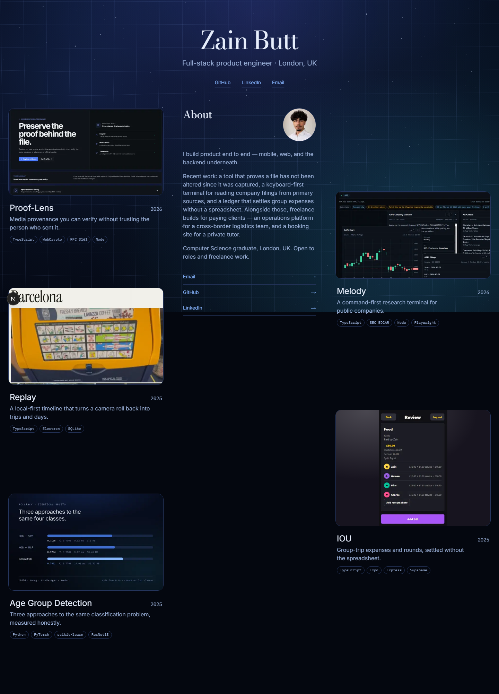

---

## The phone becomes a springboard

`3b81a17`

Five app icons on one screen, names beneath, About as two sentences between the rows. Zain's design, and the site's own model applied properly: on a phone an artefact should be something you zoom into, not something you scroll past. Four projects already had logos; the fifth was drawn to join that set. One DOM, one content source — CSS chooses the face, so the crawler and the screen reader get the same site the eye does.

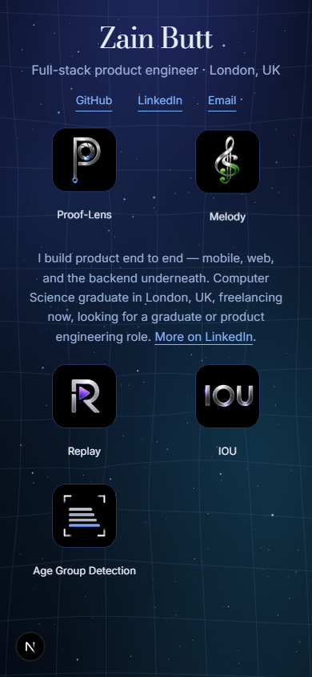

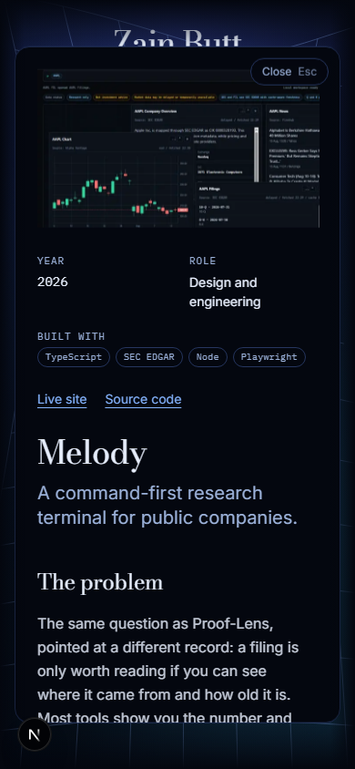

---

## Material

`e7ef3c1` · `2a8cf5c` · `4f0bf81`

Zain's verdict was that the page read clean but cheap, and he was right: nothing on it had any material. Grain over the whole ground, an edge on every artefact that catches light, and editorial furniture — a labelled section with a rule, a printed index per artefact, and a footer, because the page used to simply stop after the last card.

The crops changed with it. Both flagships were whole windows shrunk to 445px; they now show one legible detail each. The header lost its centred caption and gained a mono role label with the name half again as large against it.

Revenue OS arrived as the sixth artefact and the first that cannot be linked to — captured from a local instance, cropped by measurement clear of every prospect name and address.

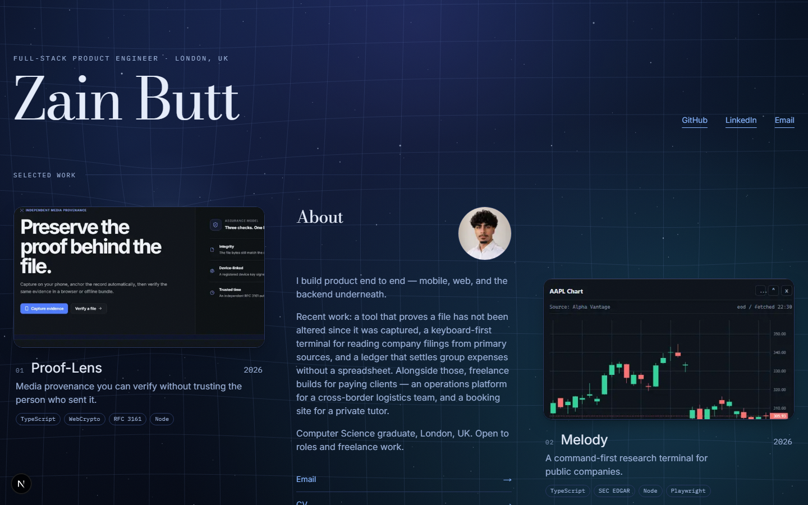

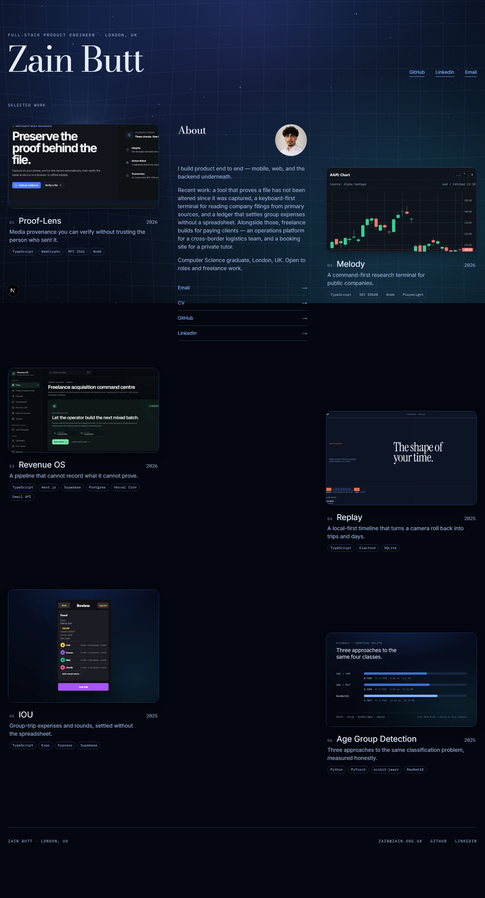

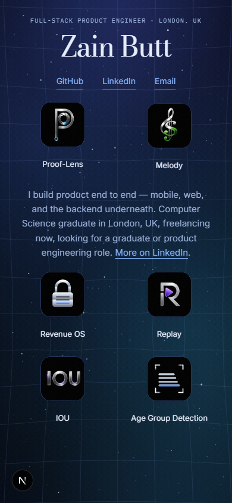

---

## The wanderer

`e5c9b0e` · `4f09023` · `8dfec81` · `f5d0f75` · `62bf960`

A fourth mass, drifting behind the page. It began invisible — only the dent travelling — then became a drawn black hole at Zain's request, with the one detail that separates it from a blue circle: the lattice dents _inward_ while starlight bends _around_, so stars near it displace outward. Same mass, opposite sign.

It can be picked up and thrown. Getting that right took two corrections from Zain: the About avoidance was dissolving it mid-flight, and an absolute noise path was snapping it home like an elastic band. It now accelerates rather than follows, so it wanders from wherever you leave it, and the mesh keeps bending even where the disc is hidden.

Its price, measured: Lighthouse performance 99 → 97, total blocking time 0 → 40ms. Desktop only, never under reduced motion, and a phone still idles at exactly zero repaints.

---
