# Progress

What the site actually looked like at each stage, rebuilt from git history
by `npx tsx scripts/progress.ts`. Reasoning behind each move is in
[`DECISIONS.md`](DECISIONS.md).

Every image below is a real screenshot of that commit running, not a mockup.

---

## White page, flanking field

`7e1321a`

First real layout. Name centred, About in the middle column, artefacts staggered down either side. Opening a project morphed a card into a separate panel.

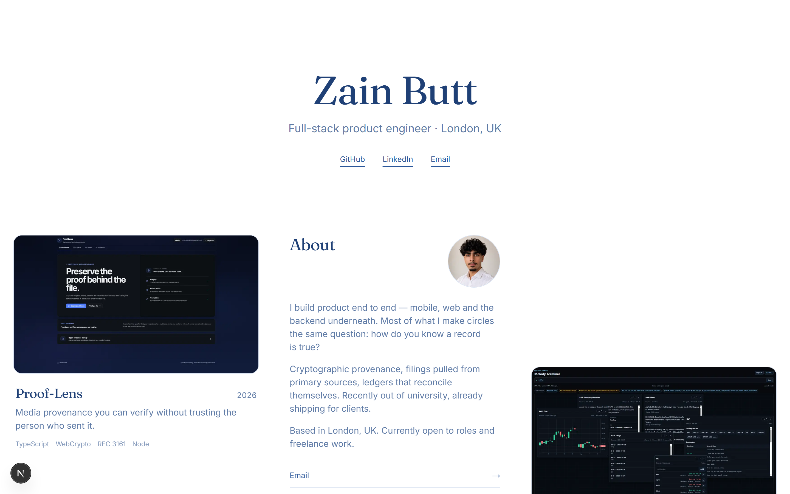

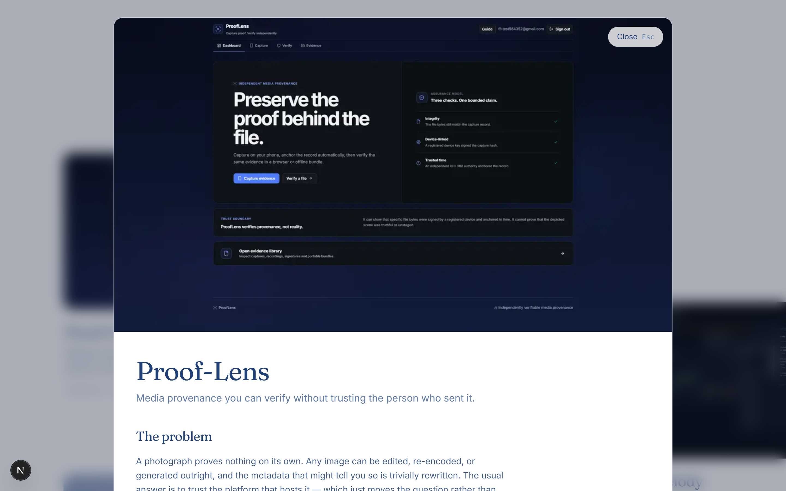

---

## One box, expanding in place

`876c5e0`

The morph was scrapped. The artefact itself now grows, its corners travelling outward via clip-path — but still over the page, so About sat behind it.

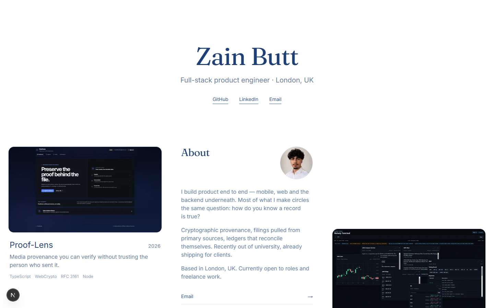

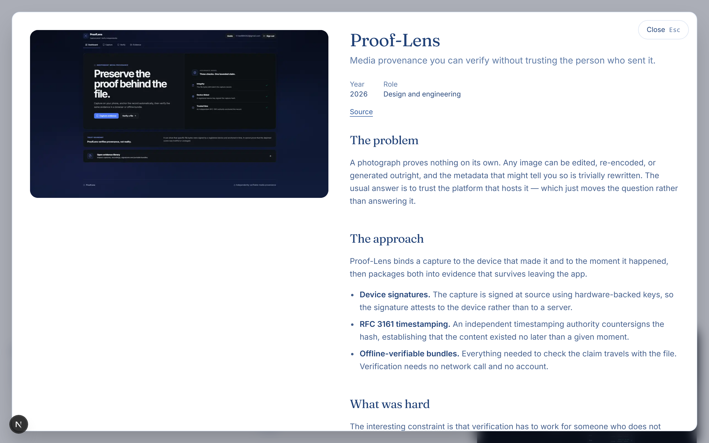

---

## A camera, not a panel

`5eb4f95`

The page became a plane the camera moves. Neighbours keep their spatial relationship instead of being covered — but the artefact was still framed too wide, so About stayed occluded.

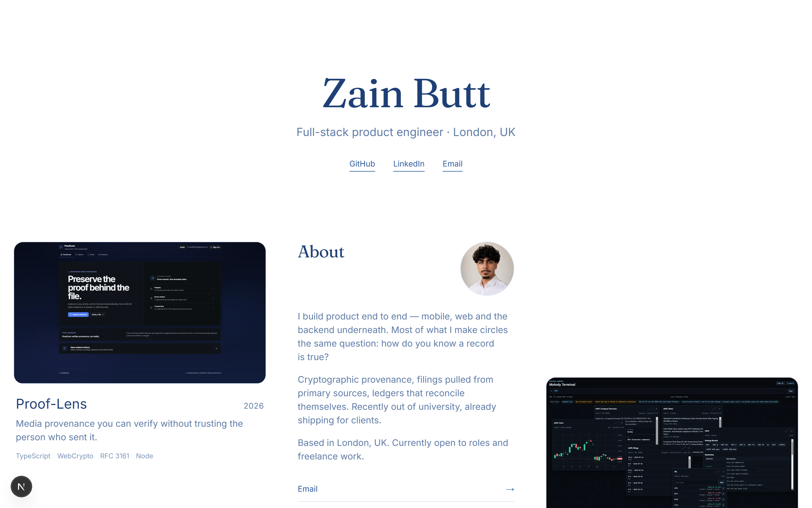

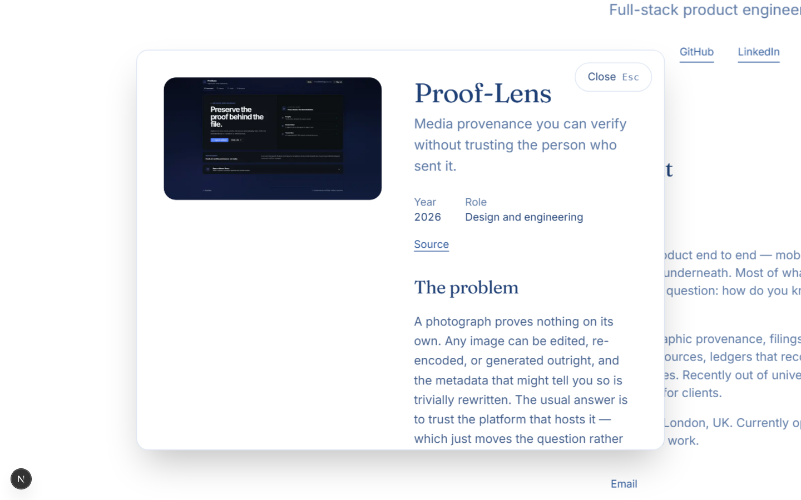

---

## First design pass

`8e76b87`

The first stage built while actually looking at the site. Metadata moved under the hero, stack became chips, and a close button that had been rendering at 2.3x on top of the tagline was fixed.

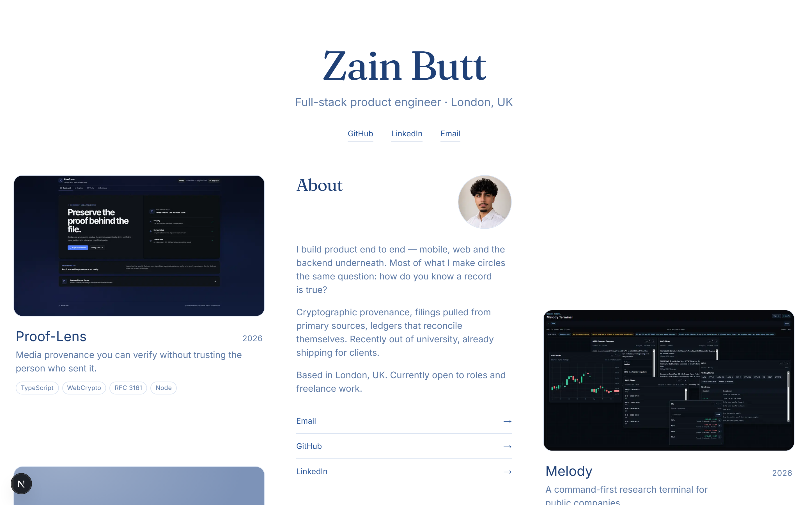

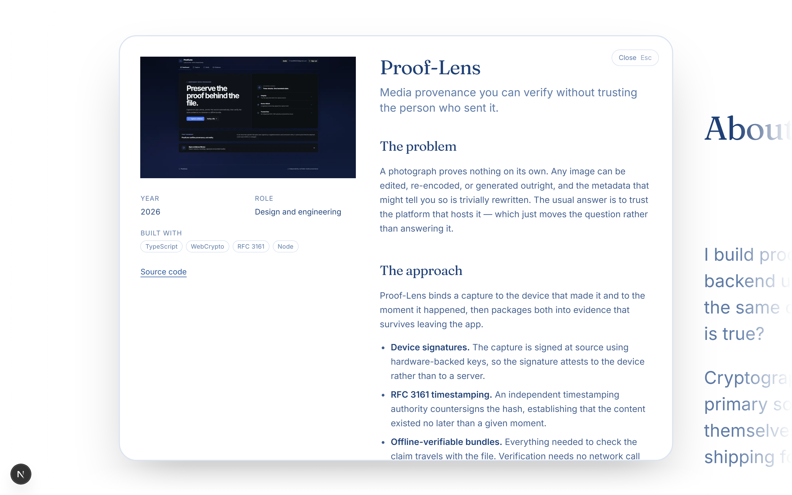

---

## The field arrives

`1f98e47`

A lattice the page's contents deform. Still on white, and still competing with the reading.

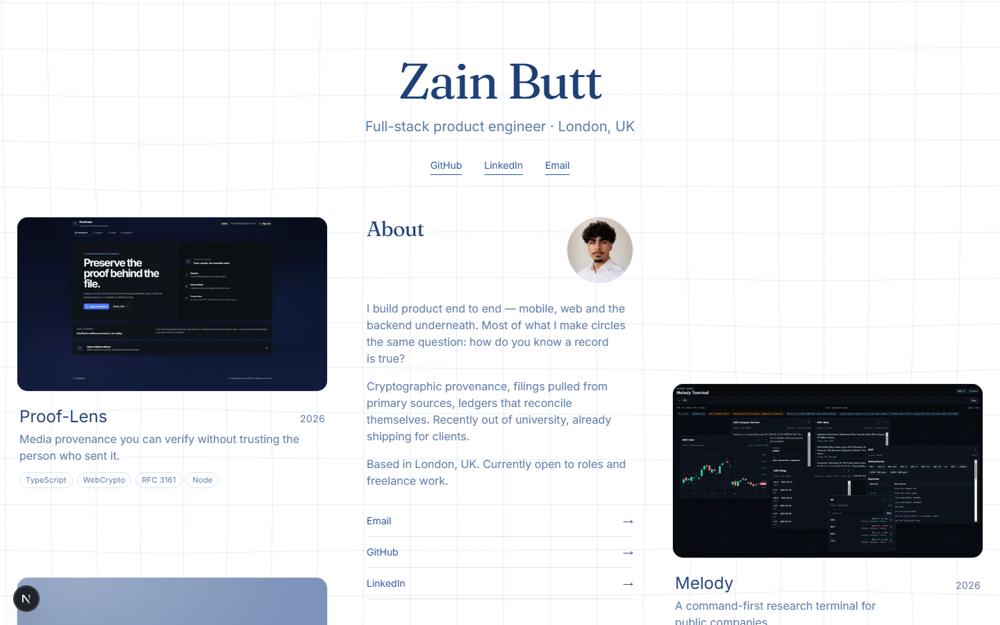

---

## Deep space

`f7d2430`

Ground inverted to deep space blue with a starfield and nebulae. The dark app screenshots stopped fighting the page. The lattice no longer folds through itself.

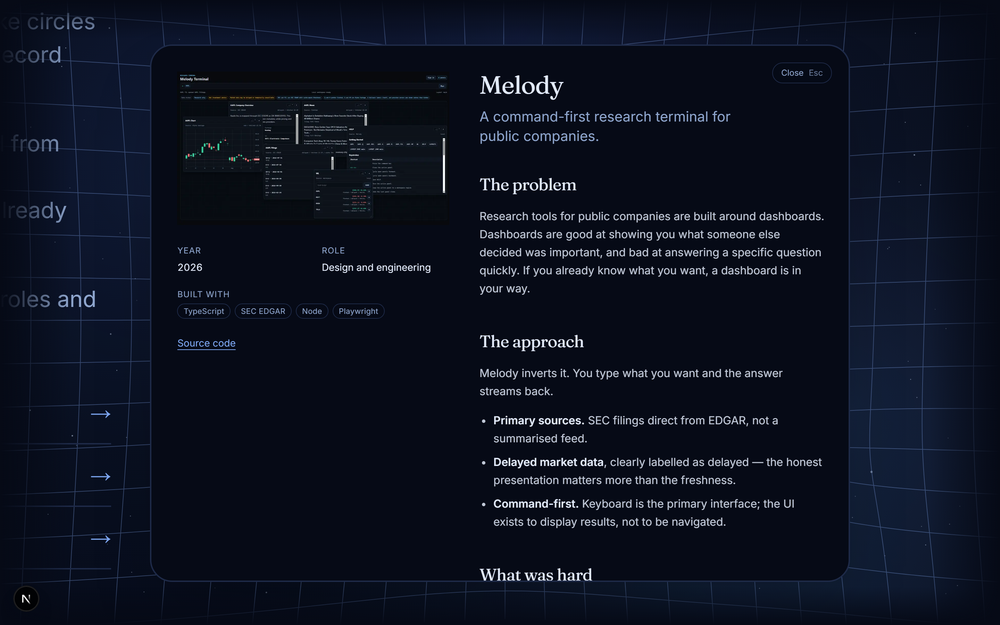

---

## Choreography

`3e03731`

Every duration and curve moved into one motion language. The case study resolves in sequence behind the opening edge rather than arriving flat with it, hovering an artefact deepens its own well so the field forecasts the open, and the first load assembles the lattice instead of showing a loader.

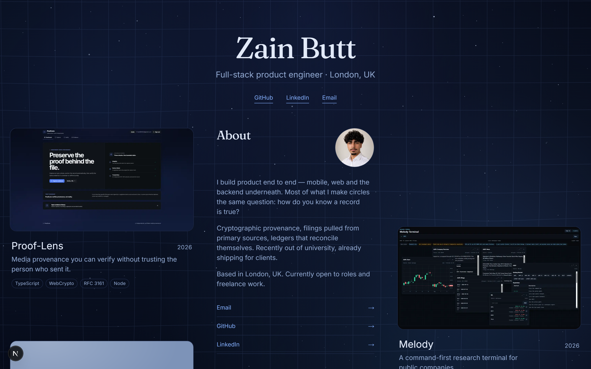

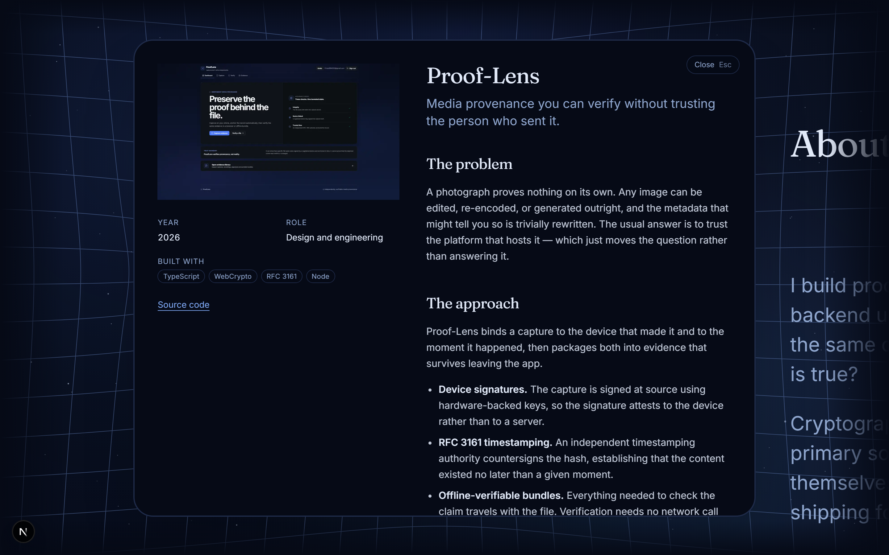

---
